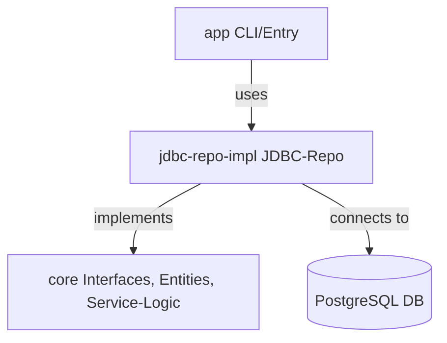

# Contact Tracing System


Ein modulares, sauberes Contact-Tracing-System für Infektionsketten, entwickelt mit Fokus auf Clean Architecture, Testbarkeit und klare Trennung von Core-Logik und Implementierung.

---

## 🏗️ Architektur



- **core**: Enthält alle Entitäten, Service- und Repository-Interfaces, sowie die Service-Logik (ohne JDBC/JPA!)
- **jdbc-repo-impl**: JDBC-Implementierung der Repositories, Datenbankzugriff
- **app**: Einstiegspunkt, CLI oder Main-Klasse

---

## ✨ Features
- Benutzer, Kontakte, Infektionsmeldungen und Infektionsketten
- Strikte Trennung von Core-Logik und Implementierung
- JDBC-only (kein Hibernate/JPA im Core)
- PostgreSQL-Datenbank (Docker-ready)
- Modularer Maven-Build
- Beispiel-SQL für DB-Setup (`db/init/01-create-tables.sql`)

---

## 🚀 Getting Started

### 1. Datenbank starten (Docker Compose)
```bash
docker-compose up -d
```

### 2. Tabellen anlegen
Die Datei `db/init/01-create-tables.sql` wird beim ersten Start automatisch ausgeführt (siehe `docker-compose.yml`).

### 3. Build & Run
```bash
mvn clean install
cd app
mvn exec:java
```

---

## 📦 Modulübersicht

| Modul             | Zweck                                      |
|-------------------|---------------------------------------------|
| core              | Entities, Interfaces, Service-Logik         |
| jdbc-repo-impl    | JDBC-Implementierung der Repositories       |
| app               | Einstiegspunkt (Main, CLI, ggf. Tests)      |
| db/init           | SQL-Skripte für DB-Setup                    |

---

## 🧑‍💻 Beispiel-Use-Case

1. **User anlegen**
2. **Kontakt-Event speichern**
3. **Infektion melden**
4. **Infektionsketten werden automatisch berechnet**

---

## 🛠️ Für Entwickler:innen
- **Build-Output (`target/`) ist nicht im Git!**
- Änderungen an Entities → immer auch SQL-Schema anpassen
- JDBC-Implementierung nur im Modul `jdbc-repo-impl`
- Core bleibt frei von Framework- oder DB-Abhängigkeiten

---

## 📄 Lizenz
MIT (oder nach Wunsch anpassen) 