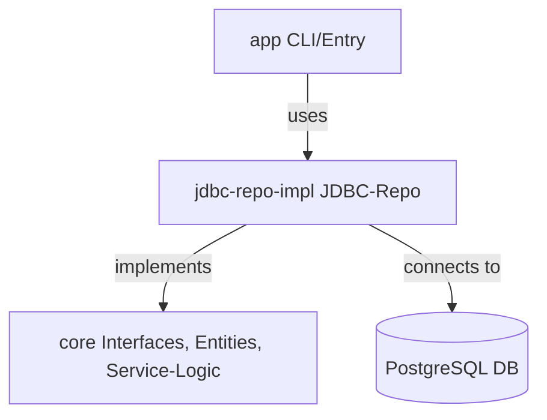

# Contact Tracing System


Ein modulares, sauberes Contact-Tracing-System für Infektionsketten, entwickelt mit Fokus auf Clean Architecture, Testbarkeit und klare Trennung von Core-Logik und Implementierung.

**Warum PostgreSQL?** Für Contact Tracing benötigen wir eine robuste, ACID-konforme Datenbank mit ausgezeichneter Unterstützung für komplexe Abfragen und Transaktionen. PostgreSQL bietet zudem native JSON-Unterstützung für flexible Datenspeicherung und hervorragende Performance bei zeitbasierten Abfragen - perfekt für Infektionsketten-Analysen.

---

## 🏗️ Architektur



- **core**: Enthält alle Entitäten, Service- und Repository-Interfaces, sowie die Service-Logik (ohne JDBC/JPA!)
- **jdbc-repo-impl**: JDBC-Implementierung der Repositories, Datenbankzugriff
- **app**: Einstiegspunkt, CLI oder Main-Klasse

---

## ✨ Features
- Benutzer, Kontakte, Infektionsmeldungen und Infektionsketten
- Strikte Trennung von Core-Logik und Implementierung
- JDBC-only (kein Hibernate/JPA im Core)
- PostgreSQL-Datenbank (Docker-ready)
- Modularer Maven-Build
- Beispiel-SQL für DB-Setup (`db/init/01-create-tables.sql`)

---

## 🚀 Getting Started

### 1. Datenbank starten (Docker Compose)
```bash
docker-compose up -d
```

### 2. Tabellen anlegen
Die Datei `db/init/01-create-tables.sql` wird beim ersten Start automatisch ausgeführt (siehe `docker-compose.yml`).

### 3. Build & Run
```bash
mvn clean install
cd app
mvn exec:java
```

---

## 📦 Modulübersicht

| Modul             | Zweck                                      |
|-------------------|---------------------------------------------|
| core              | Entities, Interfaces, Service-Logik         |
| jdbc-repo-impl    | JDBC-Implementierung der Repositories       |
| app               | Einstiegspunkt (Main, CLI, ggf. Tests)      |
| db/init           | SQL-Skripte für DB-Setup                    |

---

## 🧑‍💻 Beispiel-Use-Case

1. **User anlegen**
2. **Kontakt-Event speichern**
3. **Infektion melden**
4. **Infektionsketten werden automatisch berechnet**

---

## 🛠️ Für Entwickler:innen
- **Build-Output (`target/`) ist nicht im Git!**
- Änderungen an Entities → immer auch SQL-Schema anpassen
- JDBC-Implementierung nur im Modul `jdbc-repo-impl`
- Core bleibt frei von Framework- oder DB-Abhängigkeiten

---

## 📄 Lizenz
MIT

---

---

# Contact Tracing System


A modular, clean contact tracing system for infection chains, developed with focus on Clean Architecture, testability and clear separation of core logic and implementation.

**Why PostgreSQL?** For contact tracing, we need a robust, ACID-compliant database with excellent support for complex queries and transactions. PostgreSQL also provides native JSON support for flexible data storage and outstanding performance for time-based queries - perfect for infection chain analysis.

---

## 🏗️ Architecture


- **core**: Contains all entities, service and repository interfaces, as well as service logic (without JDBC/JPA!)
- **jdbc-repo-impl**: JDBC implementation of repositories, database access
- **app**: Entry point, CLI or main class

---

## ✨ Features
- Users, contacts, infection reports and infection chains
- Strict separation of core logic and implementation
- JDBC-only (no Hibernate/JPA in core)
- PostgreSQL database (Docker-ready)
- Modular Maven build
- Example SQL for DB setup (`db/init/01-create-tables.sql`)

---

## 🚀 Getting Started

### 1. Start Database (Docker Compose)
```bash
docker-compose up -d
```

### 2. Create Tables
The file `db/init/01-create-tables.sql` is automatically executed on first startup (see `docker-compose.yml`).

### 3. Build & Run
```bash
mvn clean install
cd app
mvn exec:java
```

---

## 📦 Module Overview

| Module            | Purpose                                     |
|-------------------|---------------------------------------------|
| core              | Entities, Interfaces, Service Logic         |
| jdbc-repo-impl    | JDBC Implementation of Repositories         |
| app               | Entry Point (Main, CLI, possibly Tests)     |
| db/init           | SQL Scripts for DB Setup                    |

---

## 🧑‍💻 Example Use Case

1. **Create User**
2. **Store Contact Event**
3. **Report Infection**
4. **Infection chains are automatically calculated**

---

## 🛠️ For Developers
- **Build output (`target/`) is not in Git!**
- Changes to entities → always adjust SQL schema as well
- JDBC implementation only in module `jdbc-repo-impl`
- Core remains free of framework or DB dependencies

---

## 📄 License
MIT 